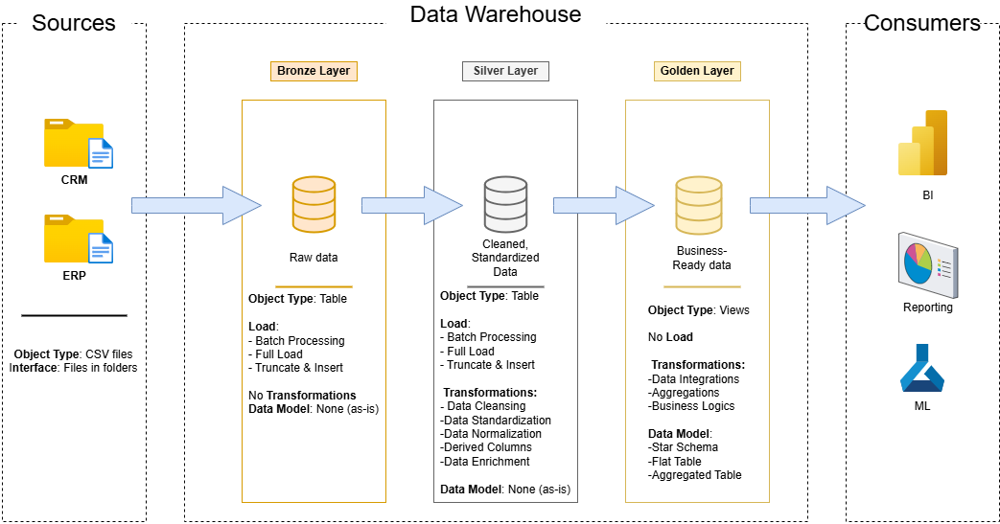

# Data Warehouse and Analytics Project

Welcome to the Data Warehouse & Analytics Project—a deep dive into building robust, scalable data solutions. This project isn't just about storing data; it's about transforming raw information into powerful, actionable insights.

From designing a data warehouse to uncovering business intelligence, this portfolio project demonstrates real-world data engineering and analytics best practices, ensuring efficiency, scalability, and impact.

---

## 🏛️ Data Architecture 

This project follows the **Medallion Architecture**, ensuring structured data processing and efficient analytics.  

### 🪵 **Bronze Layer**  
- 📥 Stores raw, unprocessed data directly from source systems.  
- 📄 Data is ingested from **CSV files** into a **SQL Server database** without transformation.  

### 🔧 **Silver Layer**  
- 🧹 Cleans, standardizes, and normalizes data for better quality.  
- 🔄 Prepares structured data for further transformation and analysis.  

### ✨ **Gold Layer**  
- 📊 Houses **business-ready, structured data** optimized for reporting.  
- 🌟 Uses a **star schema** to enable efficient analytics and decision-making.  

This architecture supports a **robust ETL pipeline**, turning raw data into **valuable insights**. 🚀  

